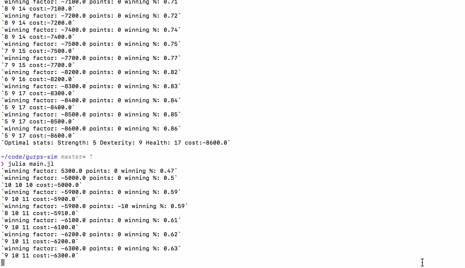

# Monte-Carlo Optimization with Julia 1.0
Show-case of a simple numerical task in Julia 1.0. 

Problem: Find optimal values of Strength, Dexterity and Health for a duel in GURPS RPG system given point value for each character statistic and penalty/reward for % of duels won.

Solution: Monte-Carlo simulation where Strength, Dexterity and Health are assigned at random (with randomness determined by a parameter) and given number of duels is conducted to calculate % of duels won.
## What does the script do?

Run 
```bash
julia main.jl
```
You will need Julia 1.0. Refer to [Julia Webpage](https://julialang.org/downloads/) for the binaries or use your package manager of choice. There are no dependancies.
It will conduct a simulated gun fight according to simplified GURPS 4ed rules 1000 times for each iteration and each iteration it will randomly change the stats of the first of dueling characters. It will accept the change only if it yielded better results (measured by % of wins and the total cost of the character's stats). The sim is ruled by the following params, which you can tweak by editing the `main.jl` script.
```julia
const SAMPLES = 1000 # number of duels in the simulation
const WINNING_REWARD = -1e4 # less is better, objective is to minimize
const LOSING_PENALTY = 1e4 # how many points it cost to be below 50% winning rate
const POINT_LIMIT = 0 # how many GURPS character points do we allow
const OVER_THE_POINT_LIMIT_PENALTY = 1e7 # penalty for characters exceeding the above limit
const TEMPERATURE = 4 # randomness in each step
const ITERATIONS = 1000 # number of iterations before stopping the sim and annuncing result
const STARTING_VECTOR = [10, 10, 10] # values for Strength, Dexterity and Health the sim will start with
const OPPONENT = [10, 10, 10] # values for Strength, Dexterity and Health of the opponent. The sim does not mutate these values
const DMG_DICE = 2 # how many D6 dice will be rolled to determine the dmg dealt on successfull hit
const PISTOL_SKILL = 2 # how much GURPS bonus to basic skill in pistol the duelists have. This is not mutated by the sim.
const MAX_ROUNDS = 10 # after that many rounds the duel is considered lost if the opponent (P2) is not disabled
```


## GURPS Rules Needed For This Simulation
GURPS 4ed rules used for this simulation:
- Character has 4 basic stats: `Intelligence`, `Dexterity`, `Health`, `Strength`. In this sim we use only `Dex`, `Health` and `Strength`, Intelligence plays no role in gun combat
- Character can also have skills, in GURPS there is much more rules for it but for this simulation we need only `Pistols`. Value of the skill added to the value of its base stat (`Dexterity` in this case) is the threshold for the test.
- The test that determines if you managed to hit a target is a sum of rolling 3 D6 dice. If you roll at or below the threshold (see previous point) you passed the test.
- But not so fast! If you shoot at someone, in GURPS they can dodge. Dodge is also determined a 3x D6 test but is based on the following formula:
```julia
    basicSpeed = (defender.health + defender.dexterity) / 4
    dodge = round(3 + basicSpeed)
```
- Who goes first in the duel? The one with higher `basicSpeed`. See the snippet above for how it is calculated from the base stats.
- What happens when your opponent shot at you, passed the test and you failed to dodge? You receive damage! To determine how much, you roll number of D6 dice specific to your weapon.
- Your number of starting `Hit Points` (and also max `Hit Points` you can have) equals your `Strength`.
- When you get to at or below `1/3` of your base `Hit Points` your character gets a special state: `reeling`. When you are reeling your `dodge` is halved.
- When you get below 0 `Hit Points` you need to start rolling a tests against your `Health` if you can still fight. Again this is a sum of 3x D6 and needs to be at or below your `Health`. Once failed you are `Disabled` and the duel is over.

